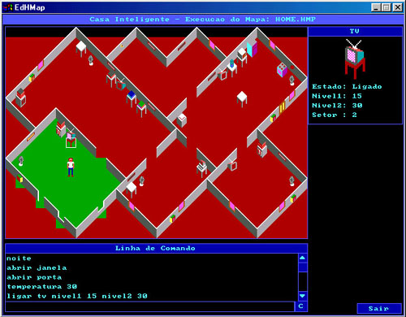

# IHOME (Intelligent Home) README

* RExLab - REmote eXperimentatioo Laboratory
* Author: Saulo Popov Zambiasi (*saulopz@gmail.com*)
* Advisor: Luiz Fernando Jacintho Maia
* Co-advisor: João Bosco da Mota Alves
* Year: 2002

## What is IHOME?

`IHOME` is based on the master's thesis by Saulo Popov Zambiasi, presented in December 2002. In this work, a hierarchical multilayer model for the implementation of intelligent environments was proposed. Distributed Artificial Intelligence (DAI) and Multigent Systems (MAS) techniques applied to home automation were used as a basis.

In the proposed model, each agent has communication specifications and a set of rules for the treatment of information, in addition to the exchange of messages between agents.

Due to budgetary and technological limitations at the time, a prototype of a simulated environment was implemented to support the life cycle and behavior of agents.

The purpose was to provide an environment where objects, such as television, air conditioning, windows, lights, etc., had a state of information, a behavior (algorithm) and could communicate with other objects and with people to give more comfort and convenience by automating the behavior of the environment. Even if the objects/agents had simple behaviors, the set of objects working collaboratively would provide a more complex overall behavior.

In the work, some types of objects/agents and a hierarchical multilevel structure for the treatment of information and message exchange between agents were presented.

The IHOME smart environment prototype was created to validate the proposed model.

The prototype was implemented in Object Pascal programming language and the Delphi IDE was used to compile the source codes and in Windows operating system. As this is a prototype, it is prone to failure and the code is not very customized.

As I don't own Delphi and I've been exclusively using a Linux operating system for over 15 years, I tried to compile the system using Lazarus [https://www.lazarus-ide.org], but I wasn't very successful and I didn't spend a lot of time to make the code compatible. However, I tested the executables on Linux using wine and the binary programs ran properly.

The prototype is distributed in three executables, the sprite editor, the map editor and the map execution prototype itself.

## Sprite Editor (edsprite.exe)

The sprite editor (`edsprite.exe`) is a program to create or edit the objects that will be available on the map. You can create new files or edit existing ones.

The Editor only supports 16 colors.

In the prototype, 19 active agents was defined, including door, window, Light, Stove, Refrigerator, Microwave, Coffee maker, Extractor, TV, Cable (cable TV), Video k7, DVD, Sound, Computer, Air conditioning, fan, shower, washing machine, clothes dryer, and 2 inactive elements, table and wall. It is important to create at least one sprite for each of the above elements.

Each active object can have up to 6 sprites. Since the name of the sprite can have up to five characters, plus the dot and plus its type.

Example: VIDEO.0, TV.3, GELAD.9

The type corresponds to a number from 0 to 5 and they refer to:

* `0` - off and left facing
* `1` - off and right fcing
* `2` - on and left facing, animation step 1
* `3` - on and right facing, animation step 1
* `4` - on and left facing, animation step 2
* `5` - on and right facing, animation step 2

Animation step 1 and step 2 serve to give the impression of movement or functioning to some objects that you find interesting. The sprites will keep switching between the sprites from step 1 and step 2 if the object is linked.

If you haven't created enough sprites to put on the system, use the ones already in the SPRITES.IMG file. If you don't do it right, it can give an error when working on the prototype and the program can abort.

## Map Editor (edhmap.exe)

The IHOME Map Editor (`edhmap.exe`) is an application for creating and editing environments for testing and simulation.

Before editing a new map, it is necessary to choose the image file to be used, in addition to selecting each image for its corresponding active or inatio object in the environment. Otherwise, the environment may not work. A prototype environment, due to implementation limitations, can only have one person, but the modeling predicts the presence of more than one person, identifying each person in the environment.

The map editor is separated into two modules, the first is the environment assembly and the second is the sectorization. To edit a map, you must select the objects and place them in the environment with the use of the mouse, and sectorization is used to separate the rooms of the house.

Separating the sectors is a very important part, as each sector manages a set of sensors (presence, voice, temperature, light, humidity, etc..).

## IHOME Software

The `ihome.exe` program is the prototype itself to simulate an intelligent environment based on the aforementioned master's dissertation.

To move the person in the environment, just click with the left mouse button on the place where you want the person to go. To select an object in the environment and view its current state, you must right-click on the object.

The runtime environment is divided into three parts, the map (environment), the object state window in the upper right corner and the command window at the bottom.

### Command Window

The command window is used to configure some information about the environment or to simulate a person's voice command. The voice command is sent directly to the voice sensor agent who evaluates the information and sends it to your manager.

At the time, the prototype was developed to be used in Portuguese. Sorry, as I couldn't compile the source codes in Lazarus, I couldn't translate the commands into English.

System Configuration Commands:

* `CHUVA` - Simulate rain
* `LIMPO` - Stop raining
* `NOITE` - night
* `DIA` - day

Voice commands:

Ok, you need write this commands on command window, but it's a prototype, it was not the focus of the work and there were several limitations at the time.

* `HOME command` - all objects in the environment will be affected.
* `SETOR XX command` - only objects from sector XX will be affected. If you only want the objects in the sector the person is in to be affected, just issue this command.
* `NIVEL1 XX object value` - configure the first information of object XX. For example, TV channel, light on or off, etc..
* `NIVEL2 XX object value` - configure the second information of object XX
* `OBJETO` - inform the object to affect
* `DORMIR` - command to a sector or all home to sleep.
* `ACORDAR` - command to a sector or all home to wake up.
* `TRAVAR` - command to a sector or home lock. Agents don't change its state.
* `DESTRAVAR` - unlock.

Examples:

* `ligar tv` - turn on the television.
* `ligar tv nivel1 03 nivel2 50` - turn on the television at channel 3 and volume 50%.
* `casa abrir janela` - open all windows in home.
* `setor 04 abrir porta` - open the doors of sector 4.
* `dormir` - command to sector where person is to sleep.
* `casa acordar` - wake up all home.

**Observation**: to know object name, click with right mouse button over object.

## Folders and Files

* \bin: exacutables
  * ihome.exe: prototype
  * edhmap.exe: map editor
  * edsprite.exe: images/sprites editor
  * home.hmp: map sample
  * sprites.img: a file sample with images used on ihome.hmp
  * sdl.dll: SDL graphic library (Sample Direct Layer www.libsdl.org)
* \doc: some notes I took at the time and others
* \src: source files in object pascal.

## Links

* Masters dissertation document 2002 [https://saulo.arisa.com.br/~saulo/ihome/Dissertacao_Ambientes_Inteligentes.pdf]
* **PAPER**: ZAMBIASI, S. P. ; VERGARA, Lizandra G Lupi. (2004). Ambientes Inteligentes Computacionais Aliados à Arquitetura. In: VIII Congresso Ibero-Americano de Gráfica Digital, 2004, São Leopoldo, RS. O Sentido e o Universo Digital. São Leopoldo, RS : UNISINOS, 2004. p. 370-373. ISBN:85-7431-224-X.[https://saulo.arisa.com.br/~saulo/aulas/Publicacoes/Saulo_Sigradi2004.pdf]
